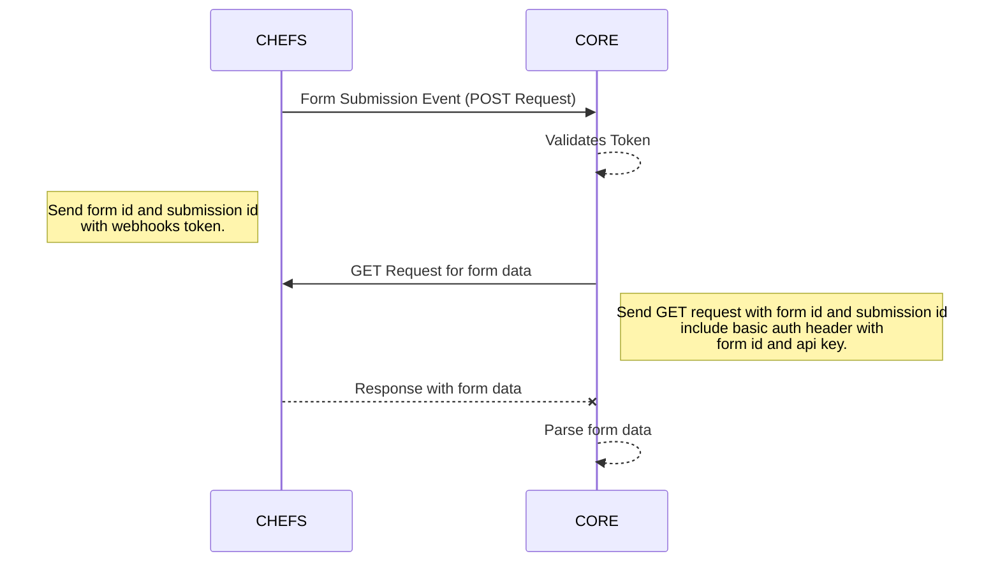

# CHEFS x CORE Integration 

 -  [What is CHEFS](#what-is-chefs)
 - [Prerequisitites](#prerequisites)
 - [Managing and Building the Form](#managing-and-building-the-form)
		 i. [access to forms](#access-to-forms) 
		 ii. [managing environments](#managing-environments)
		iii. [form builder](#form-builder)
		iv. [dynamic form data](#dynamic-form-data)
		v. [custom validation logic](#custom-validation-logic)
		vi. [(future) user program validation](#(future)-user-program-validation)
-  [Integration with CORE](#integration-with-core)
		i. [event subscription](#event-subscription)
		ii. [submission json](#submission-json)
		iii. [DTO](#dto)

 
## What is CHEFS

[CHEFS](https://submit.digital.gov.bc.ca/app) is a drag and drop form builder and is part of the [Common Components](https://digital.gov.bc.ca/common-components/) collection. We are using this in CORE for our applicant intake form. 

**Useful links:**

-  [technical documentation](https://developer.gov.bc.ca/docs/default/component/chefs-techdocs/About/)

-  [forms dashboard](https://submit.digital.gov.bc.ca/app)

- Discord / TEAMS


  
  

## Prerequisites:

- valid bc gov't IDIR to log in

- edit access to the form(s) must be given by a current developer or project manager

- access to GH repo

  
  
  

## Managing and Building the Form

  

### Access To Forms

We have three forms, one for each env. In order to access these form to make changes you will need to added by the product owner or a developer.

Here are the links to the form management pages:

[Dev Form](https://submit.digital.gov.bc.ca/app/form/manage?f=6fa9c20d-0f9b-48e7-a4f9-ae3efc32c649)

[Test Form](https://submit.digital.gov.bc.ca/app/form/manage?f=aad5e145-a39e-4284-ae27-b6eb9ee230d3)

[Prod Form](https://submit.digital.gov.bc.ca/app/form/manage?f=21bff2b3-0d47-4916-879c-7a108f9b55ff)

  

### Managing Environments

Each form has an id, an api key, an event submission url, and a webhooks token. These can be viewed/edited from the form management page. These should not be changed unless you have a specific reason to do so. Any changes you make to these values must also be updated on the specific env in our openshift secrets.

  

### Form Builder

Whenever a change is required on the form, dev should always be edited first. Once the changes are completed, the form json should be exported and committed to the repository.

  

#### Steps:

- To edit the form, go to the dashboard and click on "Manage"

  


  

- Create a new version

- Make your changes, save, publish

- Export the form json from the form management page

  


  

- Go to the management page of the test form

- Create new version

- Choose import json option

  


  

- Finally save this version and publish after updating url for dynamic form data

  
  

### Dynamic Form Data

  

The drop down menu values in our form are populated from our own API, so you will not need to update these values on the form, only on the api. Whenever you have made a change to the dev form, you will export and upload that form to the test form, and then the production form. You **must** update the referenced url in each form manually.

  

:warning: You must edit the url to match the correct env for our dynamic field data to work properly :warning:

  

#### Steps:

  

**edit this component:**


  

**click "Data" tab:**


  

**edit "Custom Default Value":**


  

**edit this url to match the env of your form:**


  
  

### Custom Validation Logic

  

The stepper logic for the top bar navigation, page validation, and dynamic error banners are all controlled by a function in the tabs component on the form. If changes are required, here are the steps to edit:

  

**To modify the stepper UI:**

- click edit and edit the CSS and logic tab


  

**To edit the tabs and/or validation:**

- click to edit the tab component


  

- select the logic tab and click edit


  

- click edit on the actions


  

- update in the javascript editor:


  
  

**Validation and Stepper Logic:**

  

```

const { root } = instance;

  

// get the tabs component

const comp = root ? root.getComponent("data") : null;

console.log("CURRRENT TAB:", comp.currentTab)

// get the current tab index

const index = comp.currentTab;

  

// query the stepper elements

const progressStepper = document.querySelectorAll(".stepperss ol li");

// reusuable functions to apply classes to the stepper elements

const invalidStep = (i) => {

progressStepper[i].classList.remove("completed");

progressStepper[i].classList.remove("disabled");

progressStepper[i].classList.remove("active");

progressStepper[i].classList.add("errors");

}

  

// reusuable functions to apply classes to the stepper elements

function validStep(i) {

progressStepper[i].classList.remove("errors");

progressStepper[i].classList.remove("disabled");

progressStepper[i].classList.remove("active");

progressStepper[i].classList.add("completed");

}

  

function initialStep(index){

progressStepper[index].classList.remove("errors");

progressStepper[index].classList.remove("disabled");

progressStepper[index].classList.add("active");

  

// If not the last step, remove the completed class

if (index < progressStepper.length - 1) {

progressStepper[index].classList.remove("completed");

}

}

  

function lastStep(index){

// If the last step, add the completed class (if valid)

if (index === progressStepper.length - 1) {

console.log("Validating Last Step");

  

let isValid = true;

isValid = root.checkValidity();

console.log("Invalid Last Step: ", isValid);

if(isValid){

validStep(index);

} else {

invalidStep(index);

}

}

};

  
  
  

function rightOfIndex(startIndex, endIndex) {

console.log("Right of Index");

  

for (let i = endIndex - 1; i > startIndex; i--) {

progressStepper[i].classList.remove("completed");

progressStepper[i].classList.remove("errors");

progressStepper[i].classList.remove("active");

progressStepper[i].classList.add("disabled");

}

};

  
  

// iterate through the step indexes and call validation depending on the index

function leftOfIndex(index) {

console.log("Left of Index");

for (let i = 0; i < index; i++) {

if (i === 0) {

console.log("Validating Step 1");

if (!validateTabOne()) {

invalidStep(i)

} else {

validStep(i);

}

} else if (i === 1) {

console.log("Validating Step 2")

if (!validateTabTwo()) {

invalidStep(i);

} else {

validStep(i);

}

} else if (i === 2) {

console.log("Validating Step 3")

if (!validateTabThree()) {

invalidStep(i);

} else {

validStep(i);

}

} else if (i === 3) {

console.log("Validating Step 4")

if (!validateTabFour()) {

invalidStep(i);

} else {

validStep(i);

}

} else {

validStep(i);

}

}

};

  

// main execution flow

(() => {

// remove the errors/disabled class from the initial step and add the active class

initialStep(index, progressStepper)

  

// call function to apply classes to the stepper elements that are left of the current index

leftOfIndex(index);

  

// call function to apply classes to the stepper elements that are right of the current index

rightOfIndex(index, progressStepper.length);

  

// call function to validate the last step

lastStep(index)

})()

  
  

// check tab one for validation errors

function validateTabOne() {

let isValid = true;

const component = root.getComponent('program');

component.setPristine(false);

const program = utils.getComponent(component.components, 'personnel.program');

isValid=program.checkValidity();

console.log("PROGRAM IS VALID");

if(isValid){

if(data.personnel.program === "BOTH"){

console.log("PROGRAM IS BOTH");

isValid = component.getComponent('ackBoth').checkValidity();

} else if (data.personnel.program === "EMCR"){

console.log("PROGRAM IS EMCR");

isValid = component.getComponent('ackEMCR').checkValidity();

} else if (data.personnel.program === 'BCWS'){

console.log("PROGRAM IS BCWS");

isValid = component.getComponent('ackBCWS').checkValidity();

}

}

console.log("IS VALID:", isValid);

return isValid;

};

  

// check tab one for validation errors

function validateTabTwo() {

const personalDetails = root.getComponent('personalDetails');

personalDetails.setPristine(false);

const emergencyContact = root.getComponent('emergencyContact');

emergencyContact.setPristine (false);

const employmentDetails = root.getComponent('employmentDetails');

employmentDetails.setPristine(false);

  

const supervisorLiaison = root.getComponent('supervisorLiaison');

supervisorLiaison.setPristine(false);

const deploymentLocationPreferences = root.getComponent('deploymentLocationPreferences');

deploymentLocationPreferences.setPristine(false);

let isValid = true;

isValid = [

personalDetails.checkValidity(),

emergencyContact.checkValidity(),

employmentDetails.checkValidity(),

supervisorLiaison.checkValidity(),

deploymentLocationPreferences.checkValidity(),

].includes(false) ? false : true;

console.log(isValid, "IS VALID");

  

return isValid;

  

};

  

function validateBCWSTabThree(){

let isValid = true;

isValid = data.bcws.firstChoiceSection && data.bcws.sections[data.bcws.firstChoiceSection].length > 0;

if(isValid && data.bcws.secondChoiceSection){

isValid = data.bcws.sections[data.bcws.secondChoiceSection].length > 0;

}

return isValid;

};

  

function validateTabThree() {

if (!data.personnel.program){

return false;

}

  

let isValid = true;

console.log(data.personnel.program, "PROGRAM");

const emcrExperiencesInterest = root.getComponent('emcrExperiencesInterest');

emcrExperiencesInterest && emcrExperiencesInterest.setPristine(false);

  

const bcwsRoles = root.getComponent('bcwsRoles');

bcwsRoles && bcwsRoles.setPristine(false);

  

if(data.personnel.program === 'EMCR'){

isValid = emcrExperiencesInterest.checkValidity();

} else if(data.personnel.program === 'BCWS'){

isValid = bcwsRoles.checkValidity();

if(isValid){

isValid = validateBCWSTabThree();

}

} else if(data.personnel.program === 'BOTH'){

isValid = emcrExperiencesInterest.checkValidity();

if(isValid){

isValid = bcwsRoles.checkValidity();

if(isValid){

isValid = validateBCWSTabThree();

}

}

}

return isValid;

};

  

function validateTabFour() {

const bcwsLanguages= root.getComponent('bcwsLanguages');

bcwsLanguages.setPristine(false);

const softwareTools= root.getComponent('softwareTools');

softwareTools.setPristine(false);

const certificationsQualifications= root.getComponent('certificationsQualifications');

certificationsQualifications.setPristine(false);

const purchaseCard= root.getComponent('purchaseCard') ;

purchaseCard.setPristine(false);

  

let isValid = true;

isValid = [

bcwsLanguages.checkValidity(),

softwareTools.checkValidity(),

certificationsQualifications.checkValidity(),

purchaseCard.checkValidity()

].includes(false) ? false : true;

return isValid

};

```

  

### User Program Validation (future)

TODO
  


## Integration with CORE

### Event Subscription Flow





### Update Event Subscription Settings:
  
- Go to manage form
- Edit subscription info


:warning: Must update new key on openshift :warning:


  
### Submission Data
- dot notation for structuring submission data
- parsing (form submission must be modified to match our DTO)
- verifying output after form changes